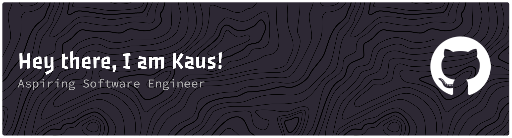

<h1>
  

  
  <!-- Social badges -->
  
  
  
</h1>

<h3> I’m a Computer Science student who learns by building. I like experimenting with apps, games, and side projects that help me explore new ideas.</h3>
<h3>Things I enjoy: </h3>

🖥️ Working with C++ and Python

🤖 Learning fundamentals & advanced topics

🎮 Playing with game mechanics and interactive ideas

✏️ Collecting mechanical pencils (yes, it’s a hobby)

 
<h2>  My Contributions </h2>

  
  
  

<picture>
  <source media="(prefers-color-scheme: light)" srcset="github-snake.svg" />
  
</picture>

<h2 align="left"> Languages and Tools:</h2>

<h3>Development </h3>

)

<h3>Tools & Design </h3>

